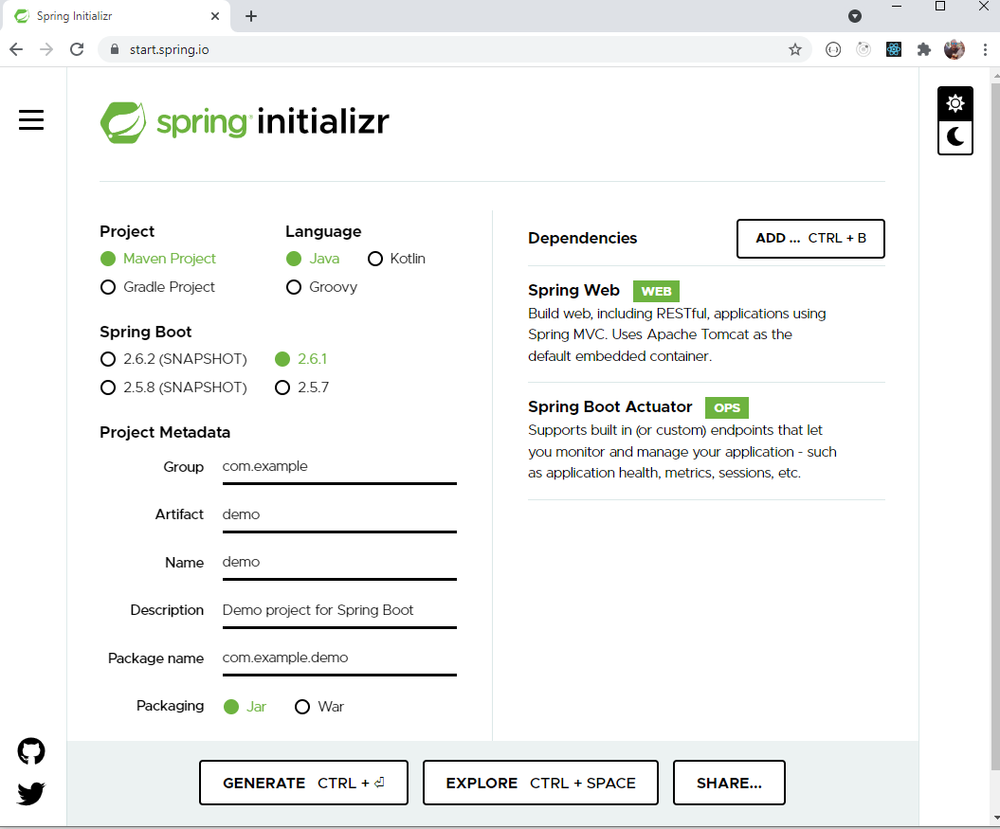

# Ejercicio-01 - Crear aplicación Spring Boot

## Enunciado
Crear un proyecto java con Spring Boot usando **[Spring initializer](https://start.spring.io/)**.



Esta aplicación deberá tener como librerías actuator y contará con un único endpoint que devolvera el texto "Hello World!". Si se le pasa por parámetro el nombre de una persona, el mensaje será "Hello Nombre!".

## Pasos para la realización del Ejercicio-01
* Generar el proyecto en **[Spring initializer](https://start.spring.io/)**.
* Extraer el proyecto y ejecutar 
    ```mvn clean install``` en la raiz del proyecto. (Es necesario la previa instalación de maven para realizar este paso)
* Abrir el proyecto con un IDE de Java (Eclipse, IntelliJ...).
* Crear una clase con el código del endpoint.
  ```java
    @RestController
    public class HelloWorldController {
	
	    @GetMapping("/helloWorld")
	    public String helloWorld(@RequestParam(name="name", required=false, defaultValue="World") 
        String name) {
		    return "Hello "+ name;
	    }
    }
  ```
* Ejecutar con: 
    * Eclipse: Ejecutar con el plugin de Spring boot
    * CLI: 
        ```
        mvn spring-boot:run
        ``` 
* Para comprobar el correcto funcionamiento de esta podemos acceder al endpoint creado anteriormente:
    
    http://localhost:8080/helloWorld  
      
    http://localhost:8080/helloWorld?name=prueba  
      


[< Training-devops](../training-devops/) | [ Ejercicio-02 - Crear una aplicación Angular >](../Ejercicio-02/)
