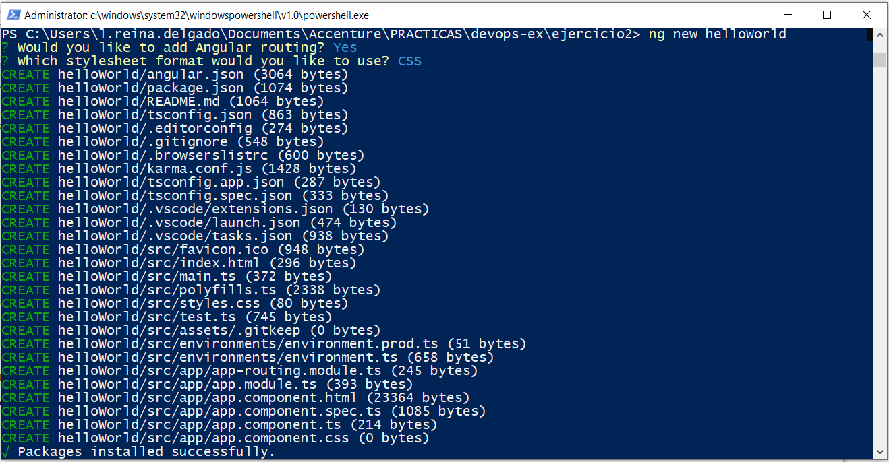
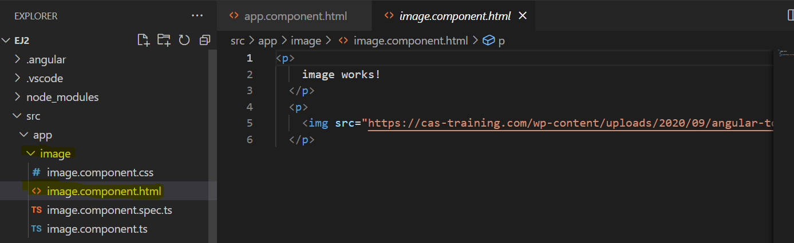
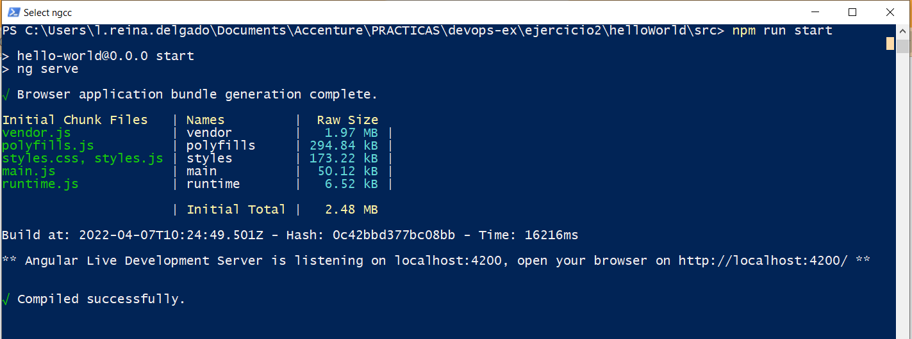
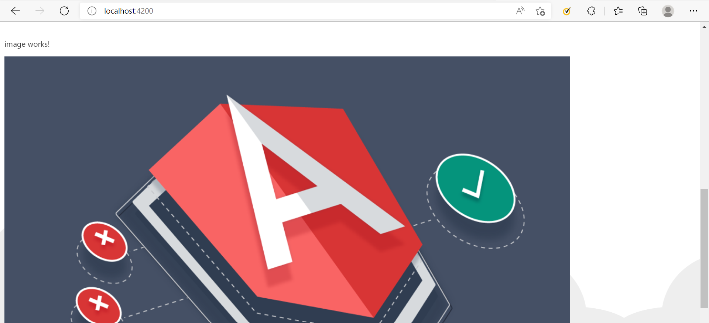

# Ejercicio-02 - Crear aplicación Angular

Crear un proyecto node con Angular que solo contenga una página html con un Hello World. Incluir alguna imagen.

* Crear un nuevo proyecto Angular con 
    ```ng new nombre-del-proyecto```
* Cambiar el HTML y crear un componente para mostrar.
* Ejecutarlo con ```npm run start```, en este caso se ha añadido ```npm run start-dev``` que abre el
  navegador automáticamente y refresca si hay cambios.

## Pasos para la realización del Ejercicio-02
Primero es necesario instalar Angular en nuesto equipo:

```sh
npm install -g @angular/cli
```
Luegos, creamos un nuevo proyecto Angular con:

```sh
ng new nombre-del-proyecto
```



Cambiar el HTML y crear un componente para mostrar.

```sh
#Generamos un nuevo componente con el nombre que queramos 
ng generate component image
```
Dentro de la carpeta app, se creará una nueva carpeta con el nombre que le hemos dado anteriormente, dentro de ahí, se generará un archivo html (app/nombre-componente/nombre.component.html) que es donde podremos crear lo que queramos.



Para que el componente se muestre, nos dirigimos a app/app.component.html y añadimos la linea <app-name></app-name> donde ¨name¨ será el nombre que le hemos asignado a nuestra componente.


Con esto último hemos hecho posible que el componente creado se muestre en la página principal de nuestro proyecto Angular.

Finalmente, ejecutarlo con `npm run start`, en este caso se ha añadido `npm run start -dev` que abre el navegador automáticamente y refresca si hay cambios.



Si nos dirigimos al navegador con el localhost:puerto que nos ha devuelto el powershell, nos aparecerá el proyecto:




[< Ejercicio-01 - Crear aplicación Spring Boot](../Ejercicio-01/) | [ Ejercicio-03 - Dockerizar aplicaciones >](../Ejercicio-03/)
