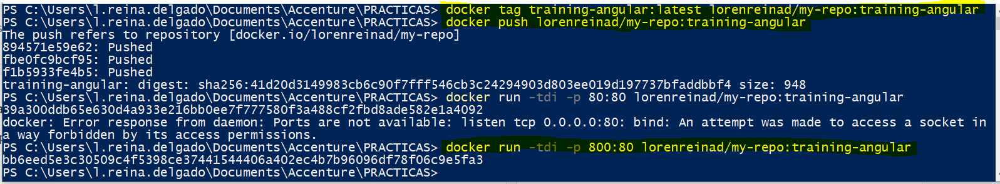

# Ejercicio-04 - Publicar imágenes en Container Registry

Publicar imágenes en el Container Registry: container-registry/training/nombre-aplicacion:version

docker tag o podman tag docker push o podman push

### Pasos para la realización del Ejercicio 4

* Hacer login en una cuenta autorizada con el comando ```az login```
* Hacer login en el Container Registry:
  ```properties
  az acr login --name container-registry
  ```
* Hacer tag y push a las imagenes
  - De Angular:
  ```properties
  docker tag training-angular container-registry/training/training-angular:0.0.1-SNAPSHOT

  docker push container-registry/training/training-angular:0.0.1-SNAPSHOT
  ```
  - De Spring Boot:
  ```properties
  docker tag training-spring-boot container-registry/training/training-spring-boot:0.0.1-SNAPSHOT

  docker push container-registry/training/training-spring-boot:0.0.1-SNAPSHOT
  ```
* Eliminar la imagen del entorno de Docker local (opcional):
  ```properties
  docker rmi container-registry/training/aplicacion:version
  ```
* Ejecutar la imagen desde el Container Registry:
  ```properties
  docker run -p LOCAL_PORT:CONTAINER_PORT container-registry/training/aplicacion:version
  ```
  Para nuestras aplicaciones: 
  ```properties
  docker run -tdi -p 80:80 container-registry/training/training-angular:0.0.1-SNAPSHOT

  docker run -tdi -p 8080:8080 container-registry/training/training-spring-boot:0.0.1-SNAPSHOT
  ```


[NOTA] Si queremos hacer un push de la imagen que tenemos en local para subirla a nuestro Dockerhub y después hacer correr nuestro contenedor desde ahí debemos ejecutar las instrucciones que aparecen en la siguiente captura. 
Siendo en este caso:
- lorenreinad: el nombre de usuario de Dockerhub
- my-repo: el nombre del repositorio público creado en tu cuenta de Dockerhub
- training-angular: el tag que le queremos poner a la imagen



[NOTA] Otra alternativa es realizar a través del repositorio local con registry. https://docs.docker.com/registry/

Se realiza el tag y push de esta manera:

 
Y una vez todo esté en el repositorio local, lo arrancamos de esta forma:


[< Ejercicio-03 - Dockerizar aplicaciones](../Ejercicio-03/) | [ Ejercicio-05 - Desplegar clúster Kubernetes >](../Ejercicio-05)

