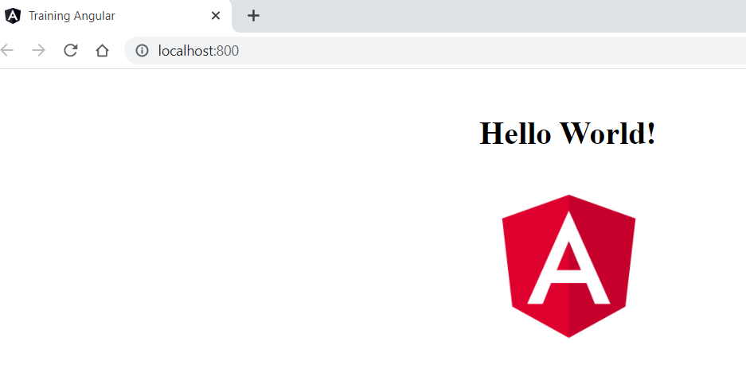

# TRAINING DEVOPS !BIENVENIDO@! #

### ¿Qué contiene este repositorio? ###

* Requisitos
* Ejercicio 1: Crear aplicación Spring Boot
  - [Descripción](https://github.com/SirNeo/training-devops#ejercicio-1)
  - [Ejecución](https://github.com/SirNeo/training-devops#pasos-para-la-realizaci%C3%B3n-del-ejercicio-1)
* Ejercicio 2: Crear aplicación Angular
  - [Descripción](https://github.com/SirNeo/training-devops#ejercicio-2)
  - [Ejecución](https://github.com/SirNeo/training-devops#pasos-para-la-realizaci%C3%B3n-del-ejercicio-2) 
* Ejercicio 3: Dockerizar aplicaciones
  - [Descripción](https://github.com/SirNeo/training-devops#ejercicio-3)
  - [Ejecución](https://github.com/SirNeo/training-devops#pasos-para-la-realizaci%C3%B3n-del-ejercicio-3) 
* Ejercicio 4: Publicar imágenes en Container Registry
  - [Descripción](https://github.com/SirNeo/training-devops#ejercicio-4)
  - [Ejecución](https://github.com/SirNeo/training-devops#pasos-para-la-realizaci%C3%B3n-del-ejercicio-4)
* Ejercicio 5: Desplegar clúster Kubernetes
  - [Descripción](https://github.com/SirNeo/training-devops#ejercicio-5)
  - [Ejecución](https://github.com/SirNeo/training-devops#pasos-para-la-realizaci%C3%B3n-del-ejercicio-5)  
* Ejercicio 6: Desplegar en AKS
  - [Descripción](https://github.com/SirNeo/training-devops#ejercicio-6)
  - [Ejecución](https://github.com/SirNeo/training-devops#pasos-para-la-realizaci%C3%B3n-del-ejercicio-6) 
* Ejercicio 7: Crear un Helm Chart
  - [Descripción](https://github.com/SirNeo/training-devops#ejercicio-7)
  - [Ejecución]() 
* Ejercicio 8: Crear pipeline
  - [Descripción](https://github.com/SirNeo/training-devops#ejercicio-8)
  - [Ejecución]() 
* Ejercicio 9: Usar Librería Global
  - [Descripción](https://github.com/SirNeo/training-devops#ejercicio-9)
  - [Ejecución]() 

### Requisitos ###

* OpenJDK
* Node.js
* Docker o Podman
* Azure CLI
* Helm 3

### Ejercicio 1 ###

Crear un proyecto java con Spring Boot usando **[Spring initializer](https://start.spring.io/)**.


Esta aplicación deberá tener como librerías actuator y contará con un único endpoint que devolvera el texto "Hello World!". Si se le pasa por parámetro el nombre de una persona, el mensaje será "Hello Nombre!".

### Ejercicio 2 ###

Crear un proyecto node con Angular que solo contenga una página html con un Hello World. Incluir alguna imagen.

### Ejercicio 3 ###

Dockerizar la aplicación creada en el ejercicio 1 y 2 y publicarlas en el Container Registry.
Crear Dockerfile
docker build o podman build
docker run o podman run

### Ejercicio 4 ###

Publicar imágenes en el Container Registry:
container-registry/training/nombre-aplicacion:version

docker tag o podman tag
docker push o podman push

### Ejercicio 5 ###

Vamos a crear e interactuar con nuestro primer clúster de Kubernetes usando [Play with Kubernetes](https://labs.play-with-k8s.com/).

### Ejercicio 6 ###

Desplegar en AKS

Crear yaml para el deployment
Crear yaml para el configmap
Crear yaml para el service
Crear yaml para el ingress


### Ejercicio 7 ###

Crear un Helm Chart para cada aplicación.

Desplegar en AKS usando el Helm Chart.

### Ejercicio 8 ###

Crear una pipeline con las stages: Build, Docker Build, Publish Container Registry, Deploy AKS

### Ejercicio 9 ###

Usar la librería global en la pipeline.


### Pasos para la realización del Ejercicio 1 ###
* Generar el proyecto en **[Spring initializer](https://start.spring.io/)**.
* Extraer el proyecto y ejecutar 
    ```mvn clean install``` en la raiz del proyecto.
* Abrir el proyecto con un IDE de Java (Eclipse, IntelliJ...).
* Crear una clase con el código del endpoint.
  ```java
    @RestController
    public class HelloWorldController {
	
	    @GetMapping("/helloWorld")
	    public String helloWorld(@RequestParam(name="name", required=false, defaultValue="World") 
        String name) {
		    return "Hello "+ name;
	    }
    }
  ```
* Ejecutar con: 
    * Eclipse: Ejecutar con el plugin de Spring boot
    * CLI: 
        ```
        mvn spring-boot:run
        ``` 
* Para comprobar el correcto funcionamiento de esta podemos acceder al endpoint creado anteriormente:
    
    http://localhost:8080/helloWorld  
      
    http://localhost:8080/helloWorld?name=prueba  
      

### Pasos para la realización del Ejercicio 2 ###

* Crear un nuevo proyecto Angular con 
    ```ng new nombre-del-proyecto```
* Cambiar el HTML y crear un componente para mostrar.
* Ejecutarlo con ```npm run start```, en este caso se ha añadido ```npm run start-dev``` que abre el
  navegador automáticamente y refresca si hay cambios.

### Pasos para la realización del Ejercicio 3
  
#### **Dockerizar la aplicación Angular**

* Instalar **[Docker](https://docs.docker.com/get-docker/)** o **[Podman](https://podman.io/getting-started/installation)**.
* Los comandos de Docker y Podman son intercambiables, simplemente escribe podman en lugar de docker para ejecutar el mismo comando. También puedes crear un alias.
  ```
  alias docker=podman
  ```
* Crear el Dockerfile correspondiente a la aplicación.
  ```dockerfile
  #Node v16
  FROM node:16-alpine as build-step 
  RUN mkdir -p /training-angular
  WORKDIR /training-angular
  COPY package.json /training-angular
  RUN npm install
  COPY . /training-angular
  RUN npm run build --prod

  FROM nginx:1.17.1-alpine
  COPY --from=build-step /training-angular/dist/training-angular /usr/share/nginx/html
  ```
* Crear el archivo .dockerignore
* Crear la imagen Docker con: 
  ```properties
  docker build -t training-angular . 
  ```
* Ejecutar el contenedor con:
  ```properties
  docker run -d -it -p LOCAL_PORT:CONTAINER_PORT training-angular
  ```
  Ejemplo: al ejecutar ```docker run -d -it -p 800:80 training-angular``` abriendo en el navegador ```localhost:800``` veríamos:  

   
   
#### **Dockerizar la aplicación Spring Boot**


* Comprobar que el bundle es correcto con Maven:
  ```properties
  mvn clean package
  java -jar target/training-spring-boot-0.0.1-SNAPSHOT.jar
    ```
  Si ejecuta correctamente en ```localhost:8080``` se puede empezar con la Dockerización

* Creación del Dockerfile:  
  Añadir un nombre final para el .jar al pom.xml:
  ```xml
  <build>
    ...
    <finalName>training-spring-boot</finalName>
    ...
  </build>
  ```
  Crear el Dockerfile:
  ```dockerfile
  FROM openjdk:11
  ADD target/training-spring-boot.jar /usr/share/training-spring-boot.jar
  CMD ["java", "-jar", "usr/share/training-spring-boot.jar"]
  ```
* Hacer build del Dockerfile:
  ```properties
  docker build -t training-spring-boot .
  ```
* Ejecutar el contenedor:
  ```properties
   docker run -tdi -p LOCAL_PORT:CONTAINER_PORT training-spring-boot
  ```

### Pasos para la realización del Ejercicio 4

* Hacer login en una cuenta autorizada con el comando ```az login```
* Hacer login en el Container Registry:
  ```properties
  az acr login --name container-registry
  ```
* Hacer tag y push a las imagenes
  - De Angular:
  ```properties
  docker tag training-angular container-registry/training/training-angular:0.0.1-SNAPSHOT

  docker push container-registry/training/training-angular:0.0.1-SNAPSHOT
  ```
  - De Spring Boot:
  ```properties
  docker tag training-spring-boot container-registry/training/training-spring-boot:0.0.1-SNAPSHOT

  docker push container-registry/training/training-spring-boot:0.0.1-SNAPSHOT
  ```
* Eliminar la imagen del entorno de Docker local (opcional):
  ```properties
  docker rmi container-registry/training/aplicacion:version
  ```
* Ejecutar la imagen desde el Container Registry:
  ```properties
  docker run -p LOCAL_PORT:CONTAINER_PORT container-registry/training/aplicacion:version
  ```
  Para nuestras aplicaciones: 
  ```properties
  docker run -tdi -p 80:80 container-registry/training/training-angular:0.0.1-SNAPSHOT

  docker run -tdi -p 8080:8080 container-registry/training/training-spring-boot:0.0.1-SNAPSHOT
  ```
  
### Pasos para la realización del Ejercicio 5

Accede al [Kubernetes Workshop](https://training.play-with-kubernetes.com/kubernetes-workshop/) y sigue las instrucciones paso a paso.


### Pasos para la realización del Ejercicio 6

* Obtener credenciales de cluster de pre
  ```properties
  az login
  az aks get-credentials --resource-group=rg-training --name=aks-devops-training-pre --subscription=azure-subscription --admin
  ```
* Archivos YAML de Training Angular:
  * Deployment:
    ```yaml
    apiVersion: apps/v1 
    kind: Deployment 
    metadata: 
      name: training-angular
      namespace: training
    spec: 
      selector: 
        matchLabels: 
          app: training-angular
      replicas: 1
      template: 
        metadata: 
          labels: 
            app: training-angular 
        spec: 
          containers: 
          - name: training-angular 
            image: container-registry/training/training-angular:0.0.1-SNAPSHOT
            ports: 
            - containerPort: 80
          imagePullSecrets: 
            - name: acr-access 
    ```
  * Service:
    ```yaml
    apiVersion: v1
    kind: Service
    metadata:
      name: training-angular
      namespace: training
    spec:
      type: ClusterIP
      ports:
      - name: http
        port: 80
        protocol: TCP
      selector:
        deployment-label-key: training-angular
    ```
  * Ingress:
    ```yaml
    apiVersion: networking.k8s.io/v1
    kind: Ingress
    metadata:
      name: training-angular
      namespace: training
    spec:
      defaultBackend:
        service:
          name: training-angular
          port:
            number: 80
      rules:
      - http:
          paths:
          - path: /
            pathType: Prefix
            backend:
              service:
                name: training-angular
                port:
                  number: 80
    ```
* Archivos YAML de Training Spring Boot:
  * Deployment:
    ```yaml
    apiVersion: apps/v1 
    kind: Deployment 
    metadata: 
      name: training-angular
      namespace: training
    spec: 
      selector: 
        matchLabels: 
          app: training-angular
      replicas: 1
      template: 
        metadata: 
          labels: 
            app: training-angular 
        spec: 
          containers: 
          - name: training-angular 
            image: container-registry/training/training-angular:0.0.1-SNAPSHOT
            ports: 
            - containerPort: 80 
          imagePullSecrets: 
            - name: acr-access
    ```
  * Service:
    ```yaml
    apiVersion: v1
    kind: Service
    metadata:
      name: training-angular
      namespace: training
    spec:
      type: ClusterIP
      ports:
      - name: http
        port: 80
        protocol: TCP
      selector:
        deployment-label-key: training-angular
    ```
  * Ingress:
    ```yaml
    apiVersion: networking.k8s.io/v1
    kind: Ingress
    metadata:
      name: training-angular
      namespace: training
    spec:
      defaultBackend:
        service:
          name: training-angular
          port:
            number: 80
      rules:
      - http:
          paths:
          - path: /
            pathType: Prefix
            backend:
              service:
                name: training-angular
                port:
                  number: 80
    ```
  * Ejecutar los .yaml en el cluster
